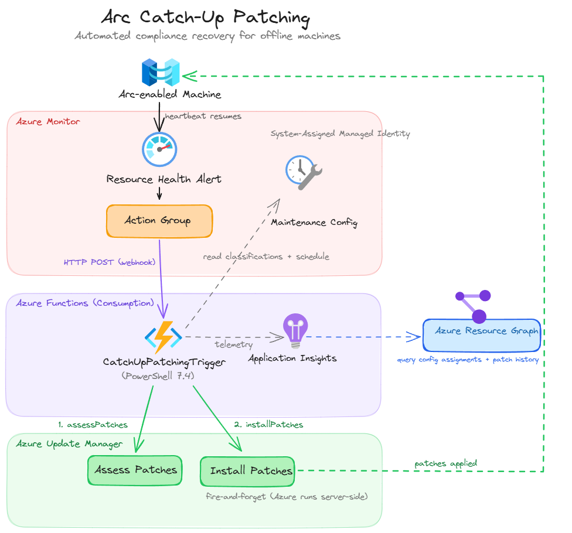
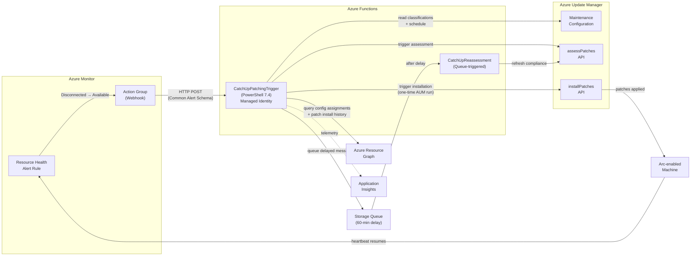
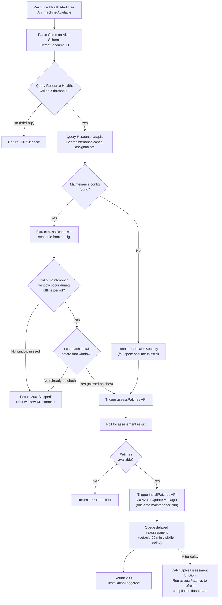

# Arc Catch-Up Patching

Automatically patches Azure Arc-enabled machines that come back online after an extended offline period, bringing them into compliance with their assigned maintenance configuration.

## Problem

When an Arc-enabled machine goes offline for longer than a monthly patch cycle (or misses its maintenance window), it falls out of compliance. Azure Update Manager's scheduled maintenance only runs during its configured window — if the machine is offline during that window, it simply gets skipped. There is no built-in mechanism to "catch up" when the machine reconnects.

This solution closes that gap. When a machine comes back online after being offline for a configurable threshold (default: 2 hours), an event-driven Azure Function automatically:

1. Validates the machine was truly offline (not just a brief network blip)
2. Reads the machine's existing maintenance configuration — both the update classifications and the schedule
3. **Checks if a scheduled maintenance window actually occurred during the offline period** — if no window was missed, the function skips patching entirely (the next window will handle it)
4. Verifies the machine's last successful patch installation was before the missed window (via AUM patch history in ARG)
5. Runs an on-demand patch assessment via Azure Update Manager (creates a history entry)
6. If patches are available, triggers a one-time update installation through AUM (creates a trackable maintenance run)
7. Schedules a delayed compliance reassessment so the AUM dashboard reflects the updated state immediately — without waiting for the next 24-hour periodic cycle

**Zero polling. Zero manual intervention. Pay-per-execution costs only.**

## Architecture



> [Open in Excalidraw](docs/architecture.excalidraw) for an editable version with Azure icons.



## Decision Flow



## Prerequisites

- **Azure Arc-enabled machines** with the Connected Machine agent installed and connected
- **Azure Update Manager** enabled on target machines (periodic assessment enabled)
- **Maintenance configurations** assigned to machines (optional — falls back to Critical + Security if none assigned)
- **Azure subscription** with permissions to deploy resources (Contributor + User Access Administrator)
- **Azure CLI** with Bicep support (`az bicep version` ≥ 0.25)

## Deployment

### 1. Clone the repo

```bash
git clone https://github.com/<your-org>/azure-hybrid-artifacts.git
cd azure-hybrid-artifacts/solutions/arc-catchup-patching
```

### 2. Review parameters

Edit `infra/main.bicepparam` to match your environment:

```bicep
using 'main.bicep'

param location = 'eastus'                    // Azure region
param baseName = 'arc-catchup-patching'      // Base name for all resources
param offlineThresholdHours = 2              // Minimum offline hours to trigger catch-up
param tags = {
  solution: 'arc-catchup-patching'
  managedBy: 'bicep'
}
```

### 3. Deploy infrastructure

```bash
# Create the resource group (if it doesn't exist)
az group create --name rg-arc-catchup-patching --location eastus

# Deploy all infrastructure
az deployment group create \
  --resource-group rg-arc-catchup-patching \
  --template-file infra/main.bicep \
  --parameters infra/main.bicepparam
```

### 4. Deploy function code

```bash
# From the function-app/ directory
cd function-app
func azure functionapp publish func-arc-catchup-patching
```

### 5. Verify deployment

```bash
# Check the Function App is running
az functionapp show --name func-arc-catchup-patching --resource-group rg-arc-catchup-patching --query "state"

# Check the alert rule is enabled
az monitor activity-log alert list --resource-group rg-arc-catchup-patching --query "[].{name:name, enabled:enabled}"
```

## Configuration

| Parameter | Default | Description |
|-----------|---------|-------------|
| `location` | `eastus` | Azure region for all resources |
| `baseName` | `arc-catchup-patching` | Base name used to derive all resource names |
| `offlineThresholdHours` | `2` | Minimum offline duration (hours) before catch-up triggers. Machines offline for less than this are ignored as brief blips. Valid range: 1–720. |
| `reassessmentDelayMinutes` | `60` | Delay in minutes before post-install compliance reassessment runs. Should exceed expected patch installation time. Valid range: 10–240. |
| `targetSubscriptionId` | Current subscription | Subscription ID to scope the Resource Health alert |
| `tags` | `solution: arc-catchup-patching` | Resource tags applied to all deployed resources |

### Runtime App Settings

| Setting | Description |
|---------|-------------|
| `OFFLINE_THRESHOLD_HOURS` | Offline threshold in hours (set automatically from Bicep parameter) |
| `REASSESSMENT_DELAY_MINUTES` | Delay before post-install compliance reassessment runs (default: 60 min) |

## How It Works

1. **Azure Arc agent** sends heartbeats every 5 minutes. If heartbeats stop for 15–30 minutes, Azure marks the machine as `Disconnected`. After 45+ days, it becomes `Expired`.

2. **Resource Health** tracks these transitions natively. When the agent reconnects and heartbeats resume, the status changes from `Unavailable` → `Available`.

3. **Activity Log alert rule** fires on this transition for `Microsoft.HybridCompute/machines` resources and sends a Common Alert Schema payload to the Action Group.

4. **Action Group** invokes the Azure Function via HTTP POST webhook.

5. **Azure Function** (PowerShell 7.4, Consumption plan) wakes up and:
   - Parses the alert payload to extract the Arc machine resource ID
   - Queries `Microsoft.ResourceHealth/availabilityStatuses` to calculate how long the machine was offline
   - If below threshold → returns "Skipped" (brief blip protection)
   - Queries Azure Resource Graph for `microsoft.maintenance/configurationassignments` linked to the machine
   - Reads each maintenance configuration to extract update classifications AND the schedule (`recurEvery`, `startDateTime`, `timeZone`)
   - **Missed-window check:** Calculates whether a scheduled maintenance window occurred during the offline period. If no window was missed, returns "Skipped" — the next scheduled window will handle it. This prevents unnecessary patching of machines that were offline but didn't miss their patch cycle.
   - Queries `patchinstallationresources` in ARG to verify the machine's last successful patch install was before the missed window
   - Falls back to Critical + Security if no maintenance config is assigned (fail-open)
   - Calls `assessPatches` on the machine and polls for the result (up to 5 min)
   - If patches are available → calls `installPatches` through Azure Update Manager (creates a one-time maintenance run with full history and traceability)
   - Queues a delayed reassessment message onto a Storage Queue (default: 60-minute visibility delay)
   - Returns a summary with patch counts, classifications applied, and correlation ID

6. **CatchUpReassessment function** (queue-triggered) wakes up after the delay and:
   - Calls `assessPatches` again to refresh the machine's compliance status in AUM
   - This ensures the compliance dashboard reflects the installed patches immediately rather than waiting for the next 24-hour periodic assessment

6. **Azure Update Manager** handles the actual patch installation server-side. The Function does not need to stay alive.

## RBAC Permissions

The Function App's system-assigned Managed Identity is automatically granted these roles:

| Role | Scope | Purpose |
|------|-------|---------|
| Azure Connected Machine Resource Administrator | Resource Group | `assessPatches` and `installPatches` API access |
| Reader | Resource Group | Resource Graph queries, reading maintenance configurations |
| Monitoring Reader | Resource Group | Resource Health availability status queries |

> **Note:** If your Arc machines span multiple resource groups, you'll need to add additional role assignments for each group. The Bicep module can be extended or the roles can be assigned at the subscription scope.

## Cost

| Component | Idle Cost | Notes |
|-----------|-----------|-------|
| Function App (Consumption Y1) | ~$0/mo | Pay-per-execution only. First 1M executions/mo free. |
| Storage Account | ~$0.01/mo | Minimal runtime files only |
| Application Insights | Free tier | Up to 5 GB/mo ingestion free |
| Resource Health Alert | Free | Built-in Azure Monitor feature |
| Action Group | Free | No charge for Azure Function receivers |

**Total idle cost: ~$0.01/month.** Cost scales linearly with the number of machines reconnecting.

## Project Structure

```
arc-catchup-patching/
├── README.md                                   # This file
├── infra/
│   ├── main.bicep                              # Orchestrator — deploys all modules
│   ├── main.bicepparam                         # Parameter file
│   └── modules/
│       ├── function-app.bicep                  # Function App + Storage + App Insights + MI
│       ├── action-group.bicep                  # Action Group with Function webhook
│       ├── alert-rule.bicep                    # Resource Health alert rule
│       └── role-assignments.bicep              # RBAC for Managed Identity
└── function-app/
    ├── host.json                               # Function runtime config (10 min timeout)
    ├── requirements.psd1                       # PowerShell module dependencies
    ├── profile.ps1                             # Managed Identity authentication
    ├── CatchUpPatchingTrigger/
    │   ├── function.json                       # HTTP POST trigger binding
    │   └── run.ps1                             # Entry point — orchestrates catch-up flow
    └── modules/
        └── CatchUpPatching.psm1                # Core logic module
```

## Troubleshooting

### Function is not triggering

1. **Verify the alert rule is enabled:** Check in Azure Portal → Monitor → Alerts → Alert Rules
2. **Check Resource Health events:** Portal → Arc machine → Resource Health. Confirm you see Unavailable → Available transitions.
3. **Test manually:** POST a sample Common Alert Schema payload to the Function URL:
   ```bash
   curl -X POST "https://func-arc-catchup-patching.azurewebsites.net/api/CatchUpPatchingTrigger?code=<function-key>" \
     -H "Content-Type: application/json" \
     -d '{"data":{"essentials":{"alertTargetIDs":["/subscriptions/<sub>/resourceGroups/<rg>/providers/Microsoft.HybridCompute/machines/<name>"]}}}'
   ```

### Function triggers but returns "Skipped"

The machine was offline for less than the configured threshold. This is expected behavior — it filters out brief network blips. Check the `offlineHours` field in the response.

### Assessment succeeds but no patches installed

The assessment found 0 available patches. The machine is already compliant. Check the response body for `status: "Compliant"`.

### Permissions errors

Verify the Managed Identity role assignments:
```bash
az role assignment list --assignee <principalId> --resource-group <rg> --output table
```

Ensure the identity has `Azure Connected Machine Resource Administrator`, `Reader`, and `Monitoring Reader`.

## Future Considerations

### 1. Thundering Herd / Rate Limiting

If many machines come back online simultaneously (e.g., after a site recovery or network restoration), the Function App could receive many concurrent triggers. While the Consumption plan scales automatically, Azure Update Manager APIs have rate limits.

**Mitigation (v2):** Add a random jitter delay (0–5 minutes) in the Function before calling the `assessPatches` API. This spreads API calls across a wider time window and avoids rate limit errors.

### 2. Notifications

It may be desirable to send a Teams message or email notification when catch-up patching runs — especially for critical machines.

**Mitigation (v2):** Add additional receivers to the Action Group (email, Teams webhook, or Logic App) that are triggered alongside the Function. Alternatively, the Function could send a notification after a successful installation trigger via a separate Action Group or direct webhook.

### 3. Multiple Maintenance Configurations per Machine

A machine may have multiple maintenance configuration assignments (e.g., one for Security patches on Tuesdays, another for Feature updates on Saturdays). The current implementation unions all classifications across all assigned configs.

**Consideration:** Validate whether unioning is the desired behavior for your environment, or whether you'd prefer to use only the most recent config, or the one with the narrowest (most conservative) classifications.

### 4. Subscription-Scoped Role Assignments

The current Bicep deploys role assignments scoped to the resource group containing the Function App. If Arc machines live in different resource groups, the Managed Identity won't have permissions to assess/install patches on them.

**Mitigation:** Modify `role-assignments.bicep` to accept an array of resource group names or deploy at subscription scope.


## License

[MIT](../../LICENSE)
